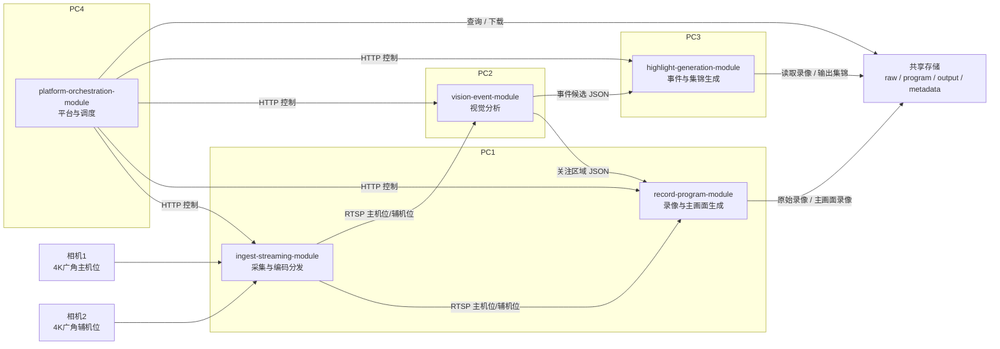

# football-auto-broadcast-足球赛事自动转播&精彩集锦生成系统

一个面向校队比赛与训练赛的轻量、可移动部署的足球自动转播与精彩集锦生成系统。

本项目聚焦于一个可落地的 MVP 版本，支持两台 4K 广角相机、有线图传、4 台 PC 分布式部署、实时自动转播主画面输出，以及赛后全场精彩集锦生成。

---

## 项目简介

足球比赛的视频采集与精彩集锦制作通常依赖大量人工，流程繁琐、耗时较长。  
本项目旨在构建一套低成本、可移动部署的足球赛事自动转播系统，支持以下能力：

- 接入两路相机视频流
- 全场原始视频录制
- 实时输出基础自动转播主画面
- 识别进球和精彩片段候选事件
- 赛后自动生成全场精彩集锦
- 提供比赛控制、状态查看和结果下载后台

本系统适用于校队比赛、训练赛、校园杯等中小型足球场景。

---

## MVP 范围

第一版 MVP 聚焦于打通一条稳定的端到端闭环流程。

### MVP 已包含功能

- 两路 4K 相机视频接入
- 原始视频实时录制
- 基于主机位的基础自动转播主画面生成
- 进球候选事件识别
- 精彩片段候选识别
- 赛后自动生成全场精彩集锦
- 基于 Docker 的多节点部署
- 基于 Git 的团队协作开发

### 未来迭代功能

- 自研无线图传
- 自研相机端嵌入式硬件
- 复杂多机位自动切镜
- 球员号码识别
- 个人集锦生成
- 全自动跨镜头球员身份统一
- 战术分析与高级统计
- 手机 App
- 云原生公网部署

---

## 系统架构

系统采用 **4 台 PC 分布式部署**，并拆分为 **5 个工程模块**：

### `ingest-streaming-module`
负责相机接入、视频编码压缩、RTSP 分发。

### `record-program-module`
负责原始录像、主画面生成、主画面录制和文件归档。

### `vision-event-module`
负责关注区域输出、进球候选识别、精彩片段候选识别。

### `highlight-generation-module`
负责读取录像和事件数据，生成全场精彩集锦并导出结果。

### `platform-orchestration-module`
负责比赛管理、任务调度、状态聚合、后台页面和结果下载。

---

## 部署拓扑

- **PC1**
  - `ingest-streaming-module`
  - `record-program-module`

- **PC2**
  - `vision-event-module`

- **PC3**
  - `highlight-generation-module`

- **PC4**
  - `platform-orchestration-module`

---

## 系统架构图

## 主要流程

### 比赛前

1. 架设两台相机
2. 配置相机输入源
3. 在平台中创建比赛
4. 初始化采集模块、录像模块和视觉模块

### 比赛中

1. 开始比赛录制
2. 录制两路原始视频
3. 输出一路自动转播主画面
4. 视觉模块持续生成关注区域和候选事件数据

### 比赛后

1. 结束比赛录制
2. 读取录像文件与候选事件
3. 生成全场精彩集锦
4. 在平台中查看并下载集锦结果

------

## 技术栈

### 核心语言

- C++
- Python，用于训练脚本和离线工具

### 多媒体处理

- GStreamer
- FFmpeg
- OpenCV

### AI 推理

- ONNX Runtime
- TensorRT

### 部署方式

- Docker
- Docker Compose

### 协作方式

- Git
- Pull Request 工作流

------

## 各模块职责

### ingest-streaming-module

- 相机流接入
- 视频编码压缩
- RTSP 视频分发
- 流状态上报

### record-program-module

- 原始录像保存
- 自动转播主画面生成
- 主画面录制
- 文件归档与索引

### vision-event-module

- 足球基础检测
- 高活跃区域分析
- 主画面关注区域输出
- 进球候选识别
- 精彩片段候选识别

### highlight-generation-module

- 候选事件解析
- 视频片段裁切
- 全场精彩集锦生成
- 集锦导出

### platform-orchestration-module

- 比赛生命周期管理
- 各模块任务编排
- 任务状态跟踪
- 后台管理页面
- 主画面预览
- 集锦结果下载
- 配置与日志管理

------

## 项目特点

- **低成本部署**
   使用多台现有 PC 构建局域网分布式系统，降低专用边缘计算设备成本。
- **关注 MVP 可落地性**
   聚焦自动转播主画面和全场精彩集锦两条主线，控制项目复杂度。
- **广角相机适配**
   视觉分析模块不依赖球员号码识别，重点关注比赛热点区域和关键事件。
- **模块职责清晰**
   五个模块职责边界明确，便于多人并行开发与联调。

------

## 当前状态

当前仓库处于 MVP 设计与实现阶段。

计划中的首个公开里程碑包括：

- 双机位视频接入
- 自动转播主画面输出
- 进球与精彩片段候选识别
- 赛后全场精彩集锦生成
- 平台统一控制与结果下载

------

## 联系方式

如有问题、功能建议或合作需求，请通过 Issue 或 Pull Request 联系。
