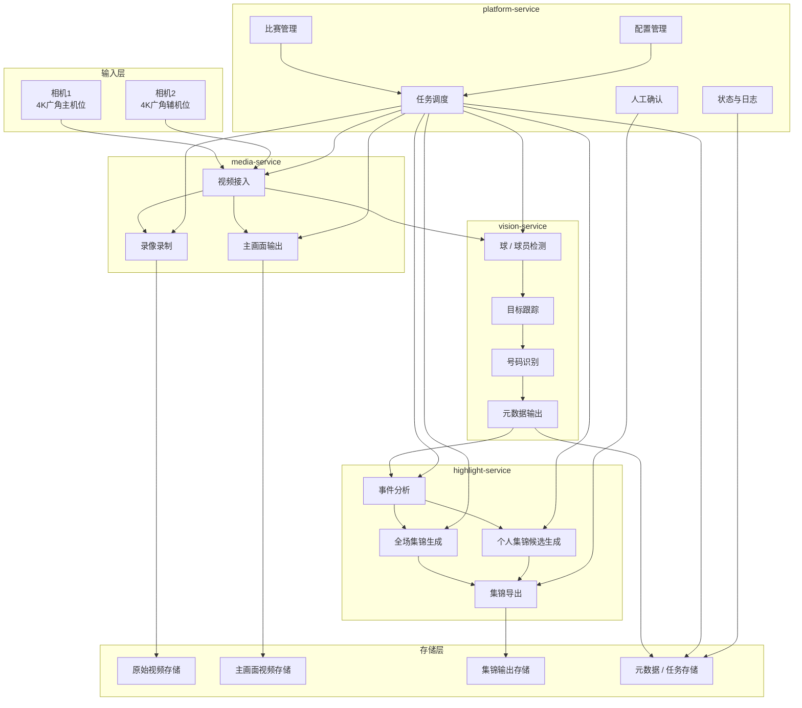

# football-auto-broadcast-足球赛事自动转播&锦集生成系统

一个面向校队比赛与训练赛的轻量、可移动部署的足球自动转播与集锦生成系统。

本项目聚焦于一个可落地的 MVP 版本，支持两台 4K 广角相机、有线图传、实时自动转播主画面输出、赛后全场集锦生成，以及半自动个人集锦生成。

---

## 项目简介

足球比赛的视频采集与集锦制作通常依赖大量人工，流程繁琐、耗时较长。  
本项目旨在构建一套可移动部署的足球赛事自动转播系统，支持以下能力：

- 接入两路相机视频流
- 全场原始视频录制
- 实时输出基础自动转播主画面
- 赛后自动生成全场集锦
- 根据指定球员号码生成个人集锦候选片段
- 支持人工确认后导出个人集锦

本系统适用于校队比赛、训练赛、校园杯等中小型足球场景。

---

## MVP 范围

第一版 MVP 聚焦于打通一条稳定的端到端闭环流程。

### MVP 已包含功能

- 两路 4K 相机视频接入
- 原始视频实时录制
- 基于主机位的基础自动转播主画面生成
- 赛后自动生成全场集锦
- 半自动生成球员个人集锦候选片段
- 人工确认候选片段后导出个人集锦
- 基于 Docker 的本地部署
- 基于 Git 的团队协作开发

### MVP 暂不包含功能

- 自研无线图传
- 自研相机端嵌入式硬件
- 复杂多机位自动切镜
- 全自动跨镜头球员身份统一
- 战术分析与高级统计
- 手机 App
- 云原生分布式部署

---

## 系统架构

系统由四个核心服务组成：

### `platform-service`
负责比赛管理、任务调度、配置管理、状态聚合，以及操作后台入口。

### `media-service`
负责视频接入、解码、录制，以及实时自动转播主画面输出。

### `vision-service`
负责足球检测、球员检测、跟踪、球衣号码候选识别，以及结构化元数据生成。

### `highlight-service`
负责事件分析、全场集锦生成、个人集锦候选生成，以及最终导出。

---

## 系统架构图

## 主要流程
### 比赛前
1.  架设两台相机 
2.  配置相机输入源 
3.  在平台中创建比赛 
4.  初始化媒体服务和视觉服务 
### 比赛中
1.  开始比赛录制 
2.  录制两路原始视频 
3.  输出一路自动转播主画面 
4.  生成赛后分析所需的结构化元数据 
### 比赛后
1.  结束比赛录制 
2.  生成全场集锦 
3.  输入球员号码生成个人集锦候选片段 
4.  人工确认候选片段 
5.  导出个人集锦视频 
## 技术栈
### 核心语言
-   C++ 
-  Python，用于训练脚本和离线工具 
### 多媒体处理
-  GStreamer 
-  FFmpeg 
-  OpenCV 
### AI 推理
-  ONNX Runtime 
-  TensorRT 
### 部署方式
-  Docker 
-  Docker Compose 
### 协作方式
-  Git 
-  Pull Request 工作流

## 各服务职责
### media-service
-  相机流接入 
-  视频解码与缓冲 
-  原始视频录制 
-  自动转播主画面输出 
-  媒体状态上报 
### vision-service
-  足球检测 
-  球员检测 
-  多目标跟踪 
-  球衣号码候选识别 
-  为下游服务生成元数据 
### highlight-service
-  候选事件分析 
-  全场集锦生成 
-  球员个人集锦候选生成 
-  集锦导出 
### platform-service
-  比赛生命周期管理 
-  各服务任务编排 
-  任务状态跟踪 
-  操作后台 
-  配置与日志管理 

## 联系方式
如有问题、功能建议或合作需求，请通过 Issue 或 Pull Request 联系。

